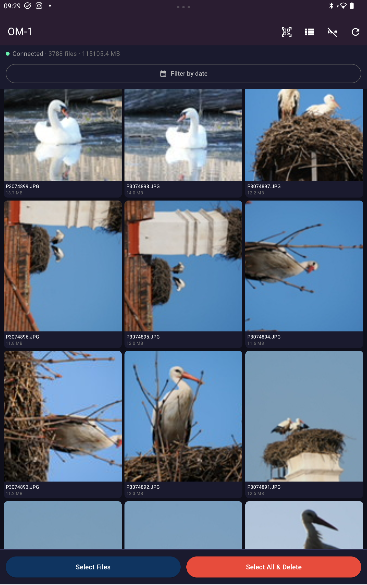
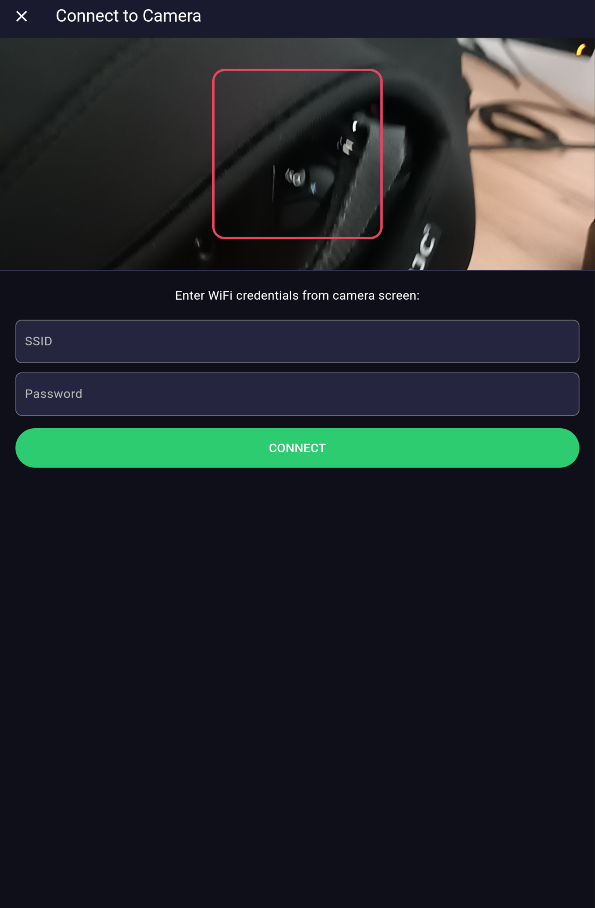

# Olympus View

Cross-platform app to manage photos on Olympus / OM System cameras via WiFi. Works on Android, Windows, and Web.

**Open source** — you can study, modify, and build the app yourself.

## Key Advantage

Unlike the official **OI.Share** app, Olympus View can:

- **Delete files from the camera** — OI.Share cannot do this
- **Select and download groups of files** by date in one tap
- **Show/hide RAW (ORF)** files to remove duplicates
- **Run on Windows and in a browser**, not just on mobile
- **Fully open source** — modify it to suit your needs

## Supported Cameras

- **Olympus TG-6** (QR format OIS1)
- **OM System OM-1** (QR format OIS3)
- Other Olympus/OM System cameras with WiFi (OPC protocol)

## Features

### Connection
- QR code scanning from camera screen (Android) — automatic WiFi connection
- Decoding proprietary OIS1 and OIS3 formats
- Manual SSID/password entry (Windows, Web)
- Bluetooth info display for BLE cameras (OM-1)

### File Management
- Photo list with thumbnails (grid / list view)
- Recursive traversal of all folders on the memory card
- Filter by date or date range (DatePicker)
- File selection: one by one, select all, or **all files for selected dates**
- Download selected files with progress
- **Delete selected files** with confirmation and progress
- Show/hide RAW files (ORF, DNG) with one button

### Download
- Android: saves to `DCIM/OlympusView` — photos appear in gallery immediately
- Windows: saves to documents folder
- Web: browser download

### Interface
- Dark Material 3 theme
- Pull-to-refresh
- Grid/list toggle
- Camera info (model)

## Screenshots

| Photo Gallery | QR Scan & Connect |
|:---:|:---:|
|  |  |
| OM-1, 3788 files | WiFi connection screen |

## Installation

### Pre-built Releases

Pre-built releases are in the `releases/` folder:

| Platform | File |
|----------|------|
| Android  | `releases/OlympusView.apk` |
| Windows  | `releases/windows/olympus_flutter.exe` |
| Web      | `releases/web/` (open `index.html`) |

### Build from Source

#### Requirements
- Flutter SDK >= 3.0
- Android SDK (for Android)
- Visual Studio with C++ (for Windows)

#### Run
```bash
flutter pub get
flutter run
```

#### Build
```bash
# Android APK
flutter build apk --release

# Windows
flutter build windows --release

# Web
flutter build web --release
```

## Usage

1. Enable WiFi on the camera
2. **Android**: scan the QR code from the camera screen — the app will connect to WiFi automatically
3. **Windows/Web**: connect to the camera's WiFi manually, enter SSID and password
4. The photo list will load automatically
5. **Long press** — enter file selection mode
6. **Date button** — select all files for the same dates
7. **RAW button** — show/hide ORF files
8. **Download button** — download selected files
9. **Delete button** — delete selected files from the camera

## Camera Protocol (OPC)

The app uses the Olympus OPC Communication Protocol:

- Camera IP: `192.168.0.10`
- File list: `GET /get_imglist.cgi?DIR=/DCIM`
- Thumbnail: `GET /get_thumbnail.cgi?DIR=<path>`
- Delete: `GET /exec_erase.cgi?DIR=<path>`
- Download: `GET /<path>`
- Play mode: `GET /switch_cammode.cgi?mode=play`
- Camera info: `GET /get_caminfo.cgi`
- Headers: `User-Agent: OI.Share v2`, `Host: 192.168.0.10`

## QR Code Decoding

### OIS1 (Olympus TG-6 etc.)
Format: `OIS1,<encoded_ssid>,<encoded_password>`

### OIS3 (OM System OM-1 etc.)
Format: `OIS3,<ver1>,<ver2>,<encoded_ssid>,<encoded_password>,<encoded_bt_name>,<encoded_bt_pass>`

Decoding algorithm: substitution cipher with a 44-character set (QR alphanumeric) and key 41.

## License

Open source. Free to use and modify.

---

# Olympus View (Українська)

Кросплатформний додаток для керування фотографіями на камерах Olympus / OM System через WiFi. Працює на Android, Windows та Web.

**Відкритий вихідний код** — ви можете вивчити, змінити та зібрати додаток самостійно.

## Ключова перевага

На відміну від офіційного додатку **OI.Share**, Olympus View вміє:

- **Видаляти файли з камери** — OI.Share цього не підтримує
- **Вибирати та завантажувати групи файлів** за датою одним натиском
- **Показувати/приховувати RAW (ORF)** файли, щоб прибрати дублі
- **Працювати на Windows та у браузері**, а не лише на мобільних
- **Повністю відкритий вихідний код** — можна модифікувати під свої потреби

## Підтримувані камери

- **Olympus TG-6** (QR формат OIS1)
- **OM System OM-1** (QR формат OIS3)
- Інші камери Olympus/OM System з WiFi (протокол OPC)

## Можливості

### Підключення
- Сканування QR-коду з камери (Android) — автоматичне підключення до WiFi
- Декодування пропрієтарних форматів OIS1 та OIS3
- Ручне введення SSID/пароля (Windows, Web)
- Відображення Bluetooth-інформації для камер з BLE (OM-1)

### Керування файлами
- Перегляд списку фотографій з мініатюрами (сітка / список)
- Рекурсивний обхід усіх папок на карті пам'яті
- Фільтрація за датою або діапазоном дат (DatePicker)
- Вибір файлів: по одному, усі одразу, або **усі за вибрані дати**
- Завантаження вибраних файлів з прогресом
- **Видалення вибраних файлів** з підтвердженням та прогресом
- Показ/приховування RAW файлів (ORF, DNG) однією кнопкою

### Завантаження
- На Android: збереження у `DCIM/OlympusView` — фото одразу з'являються у галереї
- На Windows: збереження у папку документів
- На Web: завантаження через браузер

### Інтерфейс
- Темна тема Material 3
- Pull-to-refresh
- Перемикання сітка/список
- Інформація про камеру (модель)

## Скріншоти

| Галерея фото | QR сканування |
|:---:|:---:|
|  |  |
| OM-1, 3788 файлів | Підключення до WiFi |

## Встановлення

### Готові збірки

Готові збірки знаходяться у папці `releases/`:

| Платформа | Файл |
|-----------|------|
| Android   | `releases/OlympusView.apk` |
| Windows   | `releases/windows/olympus_flutter.exe` |
| Web       | `releases/web/` (відкрити `index.html`) |

### Збірка з вихідних кодів

#### Вимоги
- Flutter SDK >= 3.0
- Android SDK (для Android)
- Visual Studio з C++ (для Windows)

#### Запуск
```bash
flutter pub get
flutter run
```

#### Збірка
```bash
# Android APK
flutter build apk --release

# Windows
flutter build windows --release

# Web
flutter build web --release
```

## Використання

1. Увімкніть WiFi на камері
2. **Android**: відскануйте QR-код з екрану камери — додаток автоматично підключиться до WiFi
3. **Windows/Web**: підключіться до WiFi камери вручну, введіть SSID та пароль
4. Список фотографій завантажиться автоматично
5. **Довге натискання** — режим вибору файлів
6. **Кнопка дати** — виділити усі файли за ті самі дати
7. **Кнопка RAW** — показати/приховати ORF файли
8. **Кнопка завантаження** — завантажити вибрані файли
9. **Кнопка видалення** — видалити вибрані файли з камери

## Ліцензія

Відкритий вихідний код. Вільне використання та модифікація.

---

# Olympus View (Русский)

Кроссплатформенное приложение для управления фотографиями на камерах Olympus / OM System через WiFi. Работает на Android, Windows и Web.

**Открытый исходный код** — вы можете изучить, изменить и собрать приложение самостоятельно.

## Ключевое преимущество

В отличие от официального приложения **OI.Share**, Olympus View умеет:

- **Удалять файлы с камеры** — OI.Share этого не поддерживает
- **Выбирать и скачивать группы файлов** по дате одним нажатием
- **Показывать/скрывать RAW (ORF)** файлы, чтобы убрать дубли
- **Работать на Windows и в браузере**, а не только на мобильных
- **Полностью открытый исходный код** — можно модифицировать под свои нужды

## Поддерживаемые камеры

- **Olympus TG-6** (QR формат OIS1)
- **OM System OM-1** (QR формат OIS3)
- Другие камеры Olympus/OM System с WiFi (протокол OPC)

## Возможности

### Подключение
- Сканирование QR-кода с камеры (Android) — автоматическое подключение к WiFi
- Декодирование проприетарных форматов OIS1 и OIS3
- Ручной ввод SSID/пароля (Windows, Web)
- Отображение Bluetooth-информации для камер с BLE (OM-1)

### Управление файлами
- Просмотр списка фотографий с превью (сетка / список)
- Рекурсивный обход всех папок на карте памяти
- Фильтрация по дате или диапазону дат (DatePicker)
- Выбор файлов: по одному, все сразу, или **все за выбранные даты**
- Скачивание выбранных файлов с прогрессом
- **Удаление выбранных файлов** с подтверждением и прогрессом
- Показ/скрытие RAW файлов (ORF, DNG) одной кнопкой

### Скачивание
- На Android: сохранение в `DCIM/OlympusView` — фото сразу появляются в галерее
- На Windows: сохранение в папку документов
- На Web: скачивание через браузер

### Интерфейс
- Тёмная тема Material 3
- Pull-to-refresh
- Переключение сетка/список
- Информация о камере (модель)

## Скриншоты

| Галерея фото | QR сканирование |
|:---:|:---:|
|  |  |
| OM-1, 3788 файлов | Подключение к WiFi |

## Установка

### Готовые сборки

Готовые сборки находятся в папке `releases/`:

| Платформа | Файл |
|-----------|------|
| Android   | `releases/OlympusView.apk` |
| Windows   | `releases/windows/olympus_flutter.exe` |
| Web       | `releases/web/` (открыть `index.html`) |

### Сборка из исходников

#### Требования
- Flutter SDK >= 3.0
- Android SDK (для Android)
- Visual Studio с C++ (для Windows)

#### Запуск
```bash
flutter pub get
flutter run
```

#### Сборка
```bash
# Android APK
flutter build apk --release

# Windows
flutter build windows --release

# Web
flutter build web --release
```

## Использование

1. Включите WiFi на камере
2. **Android**: отсканируйте QR-код с экрана камеры — приложение автоматически подключится к WiFi
3. **Windows/Web**: подключитесь к WiFi камеры вручную, введите SSID и пароль
4. Список фотографий загрузится автоматически
5. **Долгое нажатие** — режим выбора файлов
6. **Кнопка 📅** — выделить все файлы за те же даты
7. **Кнопка RAW** — показать/скрыть ORF файлы
8. **Кнопка ⬇️** — скачать выбранные файлы
9. **Кнопка 🗑️** — удалить выбранные файлы с камеры

## Протокол камеры (OPC)

Приложение использует Olympus OPC Communication Protocol:

- IP камеры: `192.168.0.10`
- Список файлов: `GET /get_imglist.cgi?DIR=/DCIM`
- Превью: `GET /get_thumbnail.cgi?DIR=<path>`
- Удаление: `GET /exec_erase.cgi?DIR=<path>`
- Скачивание: `GET /<path>`
- Режим просмотра: `GET /switch_cammode.cgi?mode=play`
- Информация о камере: `GET /get_caminfo.cgi`
- Заголовки: `User-Agent: OI.Share v2`, `Host: 192.168.0.10`

## Декодирование QR-кодов

### OIS1 (Olympus TG-6 и др.)
Формат: `OIS1,<encoded_ssid>,<encoded_password>`

### OIS3 (OM System OM-1 и др.)
Формат: `OIS3,<ver1>,<ver2>,<encoded_ssid>,<encoded_password>,<encoded_bt_name>,<encoded_bt_pass>`

Алгоритм декодирования: подстановочный шифр с набором из 44 символов (QR alphanumeric) и ключом 41.

## Лицензия

Открытый исходный код. Свободное использование и модификация.
